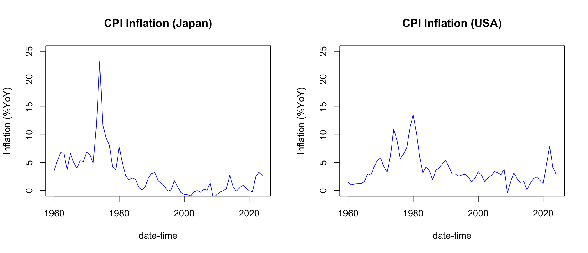

## "Alternative"

This is not a required assignment for most students in the course.

It's an alternative to **Programming Assignment 2**, for students who cannot complete that assignment on time because of an excused absence.

## Assignment Introduction

In this assignment, you'll practice some of the R skills you'll need for the final project.
The assignment is broken into 3 parts:

* `Part 1: Reading Package Docs` (20 points)
* `Part 2: Getting and Cleaning Data` (40 points)
* `Part 3: Reading Remote Files` (40 points)

## Part 1: Reading Package Docs

### Description

In the final project, you'll be asked to use some external packages to create an R processing pipeline that gets data, cleans it, analyzes it, and present results.
In this assignment, we're going to work with some of those packages to get familiar with them.

You can access R function documentation using syntax like `?function`.
This documentation typically contains a description of the function's purpose, a list of parameters, and the function signature.
In addition, many package authors include examples, small blocks of code using the package's functionality that you can copy, paste, and run directly.

In this part of the assignment, I'd like you to practice reading and running these examples.
Please copy one example of each of the following functions from its documentation.
Try running these yourself, but you do not need to include the output in your submission.

- `ymd_hms()` from the `{lubridate}` package
- `str_extract()` from the `{stringr}` package
- `setnames()` from the `{data.table}` package
- `map_dbl()` from the `{purrr}` package
- Two functions from the "Data Retrieval and Transformation" section of **the package list** ([link](./final_project_packages.md))
    - NOTE: must be from two different packages
- Two functions from the "Math and Statistics" section of **the package list** ([link](./final_project_packages.md))
    - NOTE: must be from two different packages
- Two functions from the "Visualization, Presentation, and Reporting" section of **the package list** ([link](./final_project_packages.md))
    - NOTE: must be from two different packages

**NOTE: Please, just COPY from these packages' documentation... do not write your own custom examples.**

### Submission

Upload a file to the **Programming Assignment 2** dropbox on D2L with a name like `{Firstname}_{Lastname}_Assignment2pt1.R` (example: `James_Lamb_Assignment2pt1.R`).
This file should contain 10 sections, one for each of the functions above.
Please copy one example per function into your script, and use the format given in the example below:

```{r echo = TRUE, eval = FALSE}
#==============================================================================#
# package: data.table
# function: setnames

# Example:
DT <- data.table(a=1:2,b=3:4,c=5:6) # compare to data.table
try(tracemem(DT))                  # by reference, no deep or shallow copies
setnames(DT,"b","B")               # by name, no match() needed (warning if "b" is missing)
#==============================================================================#
#==============================================================================#
# package: stats
# function: cor

# Example:
cor(1:10, 2:11) # == 1
#==============================================================================#
```

## Part 2: Getting and Cleaning Data

### Description

As you go further into the world of data science, you'll hear this said often: **most of a data scientist's time is spent getting and cleaning data**.
Let's practice that crucial activity.

In the second part of this assignment, we'll be working with data from the St. Louis Federal Reserve ([FRED](https://fred.stlouisfed.org/)).

Using the resources I've provided below, your goal is to download two series: Japanese inflation (YOY percent change) and U.S. inflation (YOY percent change).

Then you'll join them into a single `data.frame` and plot them against each other on a line plot using R's base plotting system.

- Brief R + `{quantmod}` + FRED tutorial: https://www.quantmod.com/documentation/getSymbols.FRED.html
- Tutorial on creating line plots in R's base plotting system: https://www.harding.edu/fmccown/r/

### Submission

Upload a file to the **Programming Assignment 2** dropbox on D2L with a name like `{Firstname}_{Lastname}_Assignment2pt2.R` (example: `James_Lamb_Assignment2pt2.R`).
In the example script below, I've filled in the pieces needed to pull the U.S. data.
Your task is to fill out the rest of this script so that it produces a plot comparing Japan and the U.S.

You need to complete all of the following steps, indicated by the phrase `### FILL THIS IN ###` in the example script below:

- add the command to pull the Japanese inflation data (https://fred.stlouisfed.org/series/FPCPITOTLZGJPN)
- rename the columns of the Japanese data so that the inflation series is called "JPN_INFLATION_YOY"
- add the Japanese data to the `merge()` command to create a single dataset for plotting
    - please look at the documentation for `?merge`
- initialize the plot grid to hold 2 plots in 1 row (hint: see `?par` and look for `mfrow`)
- plot the Japanese data on the left:
    - ensure the plot is a line plot (hint: see `?graphics::plot`)
    - ensure the line is blue (hint: see `col` argument)
    - set the y-axis limits to `(0, 25)`
    - set the plot title to "CPI Inflation (Japan)"
    - set the plot y-axis label to "Inflation (%YoY)"
    - set the plot x-axis label to "date-time"
- plot the U.S. data on the right
    - ensure the plot is a line plot (hint: see `?graphics::plot`)
    - ensure the line is blue (hint: see `col` argument)
    - set the y-axis limits to `(0, 25)`
    - set the plot title to "CPI Inflation (USA)"
    - set the plot y-axis label to "Inflation (%YoY)"
    - set the plot x-axis label to "date-time"

```{r quandlData, eval = FALSE, echo = TRUE, message = FALSE, warning=FALSE}
# Load dependencies
library(quantmod)

# Get Data
usaDF <- as.data.frame(
    quantmod::getSymbols(
        Symbols = "FPCPITOTLZGUSA"
        , src = "FRED"
        , auto.assign = FALSE
    )
)
usaDF["Date"] <- as.Date(row.names(usaDF))

jpnDF <- as.data.frame(
    quantmod::getSymbols(
    ### FILL THIS IN ###
    )
)
jpnDF["Date"] <- as.Date(row.names(jpnDF))

# rename columns
names(usaDF) <- c("USA_INFLATION_YOY", "Date")
names(jpnDF) <- ### FILL THIS IN ###

# Combine the two data.frames with merge()
mergedDF <- merge(
    x = usaDF,
    y = ### FILL THIS IN ###,
    by = "Date"
)

par(
    ### FILL THIS IN ###,
)

# Plot the Japanese data on the left
plot(
    x = mergedDF$Date,
    y = mergedDF$JPN_INFLATION_YOY,
    type = ### FILL THIS IN ###,
    main = ### FILL THIS IN ###,
    xlab = ### FILL THIS IN ###,
    ylab = ### FILL THIS IN ###,
    col = ### FILL THIS IN ###,
    ylim = ### FILL THIS IN ###
)

# Plot the U.S. data on the right
plot(
    x = mergedDF$Date,
    y = mergedDF$USA_INFLATION_YOY,
    type = ### FILL THIS IN ###,
    main = ### FILL THIS IN ###,
    xlab = ### FILL THIS IN ###,
    ylab = ### FILL THIS IN ###,
    col = ### FILL THIS IN ###,
    ylim = ### FILL THIS IN ###
)
```

If this works correctly, you should see a plot similar to this:

<center></center>

## Part 3: Reading Remote Files

### Description

In the final project, you'll be asked to submit code that reads in data from remote storage.

In this part of the assignment, you'll practice this important skill.

**hint:** Read https://jameslamb.github.io/intro-to-r/code/programming-supplement.html#Working_with_Files for some information about reading data from files.

### Submission

Upload a file to the **Programming Assignment 2** dropbox on D2L with a name like `{Firstname}_{Lastname}_Assignment2pt3.R` (example: `James_Lamb_Assignment2pt3.R`).

In the file, implement 2 functions:

* `get_remote_data()`
    - takes 2 arguments:
        - `url`: string containing a URL pointing to a CSV file on the internet
        - `data_path`: file path to write the output data to
    - prints the following message: `"Downloaded data from '<url>'. Full dataset has <m> rows and <n> columns."`
        - `<url>` is replaced with the URL passed via `url`
        - `<m>` is replaced with the number of rows in the data
        - `<n>` is replaced with the number of columns in the data
    - returns a `data.frame` representation of the file's contents
    - writes the `data.frame`'s content as a CSV to the path indicated by `data_path`
    - if a file already exists at `data_path`, reads that file in and does not try to re-download from `url`
* `get_dataset()`
    - takes 4 arguments:
        - `url`: same interpretation as above
        - `data_path`: same interpretation as above
        - `num_rows`: an integer. If `>=1`, the function returns the first `num_rows` rows of the data. If `<= 0`, the function returns all rows.
        - `num_cols`: an integer. If `>=1`, the function returns the first `num_cols` columns of the data. If `<= 0`, the function returns all rows
    - if `num_rows` is greater than the total number of rows in the data frame, the function throws an error with the message `"num_rows (<num_rows>) is too high (full dataset has <m> rows)"`, where `<num_rows>` and `<m>` replaced with the actual values as described above
    - if `num_cols` is greater than the total number of rows in the data frame, the function throws an error with the message `"num_cols (<num_cols>) is too high (full dataset has <n> columns)"`, where `<num_cols>` and `<n>` replaced with the actual values as described above
    - calls `get_remote_data()` and uses its result
    - returns a `data.frame` with the first `num_rows` and `num_cols` of the data indicated by `url`

Your submitted script should only contain `library()` calls (if you choose to use external packages) and your implementations
of those 2 functions.

Follow the template below, only adding code between the `###` comments.

**Any code you add outside those `###` comments will be ignored.**

```r
### BEGIN CODE ###
# (optional - add library() calls here)
### END CODE ###

get_remote_data <- function(url, data_path){
    ### BEGIN CODE ###
    # (add code here)
    ### END CODE ###
}

get_dataset <- function(url, data_path, num_rows, num_cols){
    ### BEGIN CODE ###
    # (add code here)
    ### END CODE ###
}
```

Test your code using the following snippet.

**Do not include this test code in your submission**.

```r
#--- test 1: should print and return the expected data ---#
fullDF <- get_remote_data(
    url = "https://raw.githubusercontent.com/jameslamb/intro-to-r/refs/heads/main/sample-data/iris.csv",
    data_path = "out.csv"
)
# "Downloaded data from 'https://raw.githubusercontent.com/jameslamb/intro-to-r/refs/heads/main/sample-data/iris.csv'. Dataset has 150 rows and 6 columns."

#--- test 2: should use the local file ---#
fullDF <- get_remote_data(
    url = "irrelevant-because-the-local-file-should-be-used-instead",
    data_path = "out.csv"
)
# "Downloaded data from 'https://raw.githubusercontent.com/jameslamb/intro-to-r/refs/heads/main/sample-data/iris.csv'. Dataset has 150 rows and 6 columns."

#--- test 3: should subset rows ---#
subsetDF <- get_dataset(
    url = "https://raw.githubusercontent.com/jameslamb/intro-to-r/refs/heads/main/sample-data/iris.csv"
    , data_path = "out.csv"
    , num_rows = 27
    , num_cols = -1
)
stopifnot(dim(subsetDF) == c(27, 6))

#--- test 4: should return all rows and columns if num_rows == -1 and num_cols == -1 ---#
subsetDF <- get_dataset(
    url = "https://raw.githubusercontent.com/jameslamb/intro-to-r/refs/heads/main/sample-data/iris.csv"
    , data_path = 
    , num_rows = -1
    , num_cols = -1
)
stopifnot(dim(subsetDF) == c(150, 6))

#--- test 5: should subset columns ---#
subsetDF <- get_dataset(
    url = "https://raw.githubusercontent.com/jameslamb/intro-to-r/refs/heads/main/sample-data/iris.csv"
    , data_path = "out.csv"
    , num_rows = -1
    , num_cols = 2
)
stopifnot(dim(subsetDF) == c(150, 2))

#--- test 6: should raise expected error if num_rows too high ---#
subsetDF <- get_dataset(
    url = "https://raw.githubusercontent.com/jameslamb/intro-to-r/refs/heads/main/sample-data/iris.csv"
    , data_path = "out.csv"
    , num_rows = 500
    , num_cols = -1
)
# error: "num_rows (500) is too high (full dataset has <150> rows)"

#--- test 7: should raise expected error if num_cols too high ---#
subsetDF <- get_dataset(
    url = "https://raw.githubusercontent.com/jameslamb/intro-to-r/refs/heads/main/sample-data/iris.csv"
    , data_path = "out.csv"
    , num_rows = -1
    , num_cols = 18
)
# error: "num_cols (18) is too high (full dataset has <6> columns)"
```

<br><br><br>
